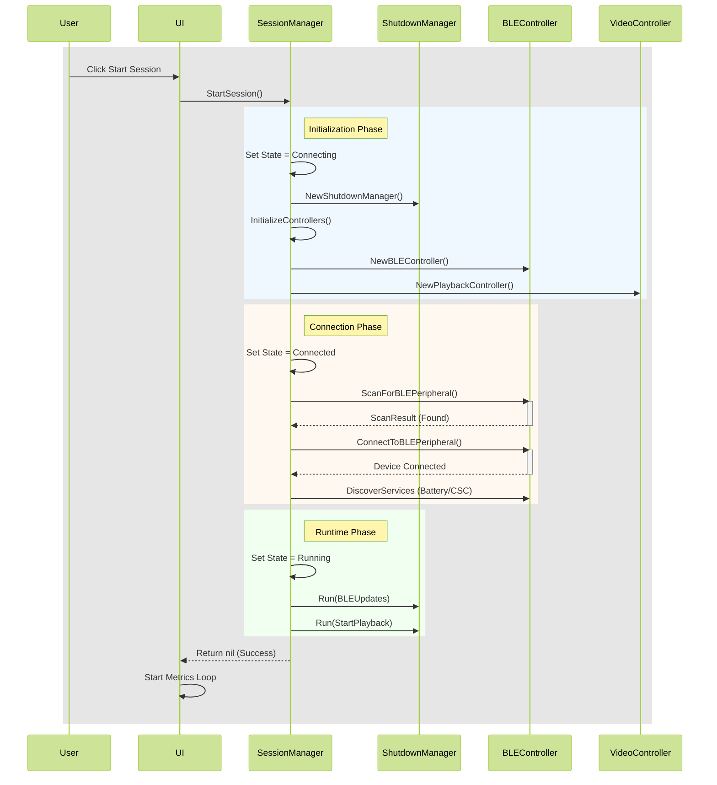

<!-- markdownlint-disable MD033 -->
<!-- markdownlint-disable MD041 -->

<!-- markdownlint-disable MD033 -->

<!-- markdownlint-enable MD033 -->

At a high level, **BLE Sync Cycle** coordinates with a BLE central device (such as a computer), a BLE peripheral device (a BLE cycling sensor) and a media player (mpv or VLC), and performs the following:

### 1. Discovery and Connection

1. The BLE central device scans for the BLE peripheral device (your BLE cycling sensor)
2. The BLE central device connects to the sensor and queries for various BLE services: battery power and cycling speed

### 2. Synchronization and Real-Time Data Processing

1. The BLE central device starts receiving from the sensor real-time speed data at regular intervals

### 3. Video Playback and Display

1. The application then launches a media player for video playback
2. The application automatically adjusts video speed based on incoming cycling speed data: pedal faster and the video playback speed increases; pedal slower and the video playback speed decreases
3. The application displays real-time cycling statistics via its application interface and, optionally, the media player's on-screen display (OSD)

### 4. Application Shutdown

1. The application shuts down on user interrupt, application exit, or at the end of video playback. The shutdown process coordinates with the BLE central device, the BLE peripheral device, and the media player to ensure a smooth and clean shutdown.

## A More Technical View of the Application Workflow

For those with an interest in how the various controllers and services work collaboratively in **BLE Sync Cycle**, here's a sequence diagram for the "happy path" use case, where a user selects and loads a session, starts a session, and "cycles" the session until completion.

